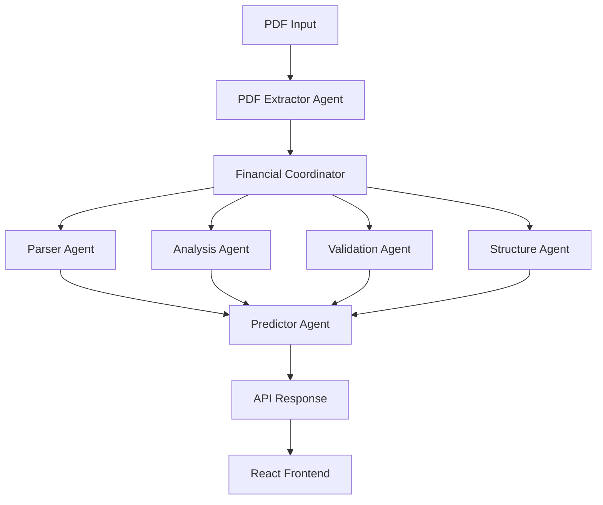

# 🧠 Sistema Multi-Agente Financiero (agent_LLM)

[](https://www.python.org/downloads/)
[](https://fastapi.tiangolo.com/)
[](https://reactjs.org/)
[](LICENSE)

## 📋 Descripción

Este proyecto implementa un **sistema multi-agente avanzado** diseñado para el análisis automatizado de documentos financieros, especializado en el procesamiento de **Memorias Anuales bancarias**. 

El sistema utiliza inteligencia artificial para extraer, procesar y analizar información financiera compleja, proporcionando insights valiosos y predicciones sobre indicadores clave de rendimiento (KPIs).

### 🎯 ¿Qué hace el sistema?

- **Procesa automáticamente** PDFs de memorias anuales bancarias
- **Extrae y estructura** los cuatro estados financieros principales
- **Genera predicciones** sobre KPIs financieros relevantes
- **Responde preguntas** en lenguaje natural sobre los datos financieros
- **Valida información** según estándares regulatorios

## ✨ Características Principales

### 🔄 Pipeline Completo de Ingest & Retrieve
- Lectura automática de PDFs complejos
- Extracción inteligente de tablas y datos financieros
- Organización estructurada de información

### 📊 Extracción de Estados Financieros
Procesamiento automático de los **4 estados financieros principales**:
- **Balance General** - Posición financiera en un momento específico
- **Cuenta de Resultados** - Rendimiento financiero durante un período
- **Estado de Cambios en el Patrimonio Neto** - Variaciones en el capital
- **Estado de Flujos de Efectivo** - Movimientos de efectivo

### 🤖 Arquitectura Multi-Agente
Sistema coordinado por un **Financial Coordinator** que distribuye tareas entre:

| Agente | Función | Especialización |
|--------|---------|----------------|
| **Parser Agent** | Extracción de texto | OCR y procesamiento de PDFs |
| **Analysis Agent** | Análisis contable | Interpretación de datos financieros |
| **Validation Agent** | Validaciones | Cumplimiento regulatorio |
| **Structure Agent** | Estructuración | Organización de datos |
| **Predictor Agent** | Predicción | KPIs y forecasting |

### 📈 Predicción de KPIs
Estimación inteligente de indicadores clave:
- **Rentabilidad**: ROE, ROA, margen neto
- **Solvencia**: Ratio de capital, tier 1
- **Liquidez**: Ratio de liquidez, LCR
- **Eficiencia**: Ratio de eficiencia operativa

## 🔍 Modos de Interacción

### 💬 Conversación Natural
```
Usuario: "¿Cuál fue la rentabilidad del banco el año pasado?"
Sistema: "Según la memoria anual, el ROE fue del 12.5%, superior al 11.2% del año anterior..."
```

### 🔍 Análisis Detallado
- Ejecución de pipelines predefinidos
- Análisis comparativo temporal
- Benchmarking sectorial
- Detección de anomalías

### 📊 Informes Personalizados
- Generación automática de reportes
- Visualizaciones interactivas
- Exportación en múltiples formatos

## ⚙️ Arquitectura Técnica



### 🖥️ Stack Tecnológico

**Backend**
- **FastAPI**: Framework web moderno y rápido
- **Python 3.10+**: Lenguaje principal
- **LangChain**: Orquestación de LLMs
- **PyPDF2/PDFPlumber**: Procesamiento de PDFs
- **Pandas**: Manipulación de datos

**Frontend**
- **React 18+**: Biblioteca de UI
- **Material-UI**: Componentes de diseño
- **Axios**: Cliente HTTP
- **Chart.js**: Visualizaciones

**Base de Datos & Storage**
- **SQLite/PostgreSQL**: Almacenamiento estructurado
- **Vector Database**: Búsqueda semántica
- **Redis**: Caché de sesiones

## 📂 Estructura del Proyecto

```
agent_LLM/
├── 🚀 api/                          # Backend FastAPI
│   ├── main_api.py                  # Punto de entrada principal
│   ├── routers/                     # Endpoints organizados
│   │   ├── financial.py             # Rutas financieras
│   │   ├── analysis.py              # Rutas de análisis
│   │   └── upload.py                # Rutas de carga
│   ├── services/                    # Lógica de negocio
│   ├── models/                      # Modelos de datos
│   └── utils/                       # Utilidades
│
├── 🤖 agents/                       # Sistema Multi-Agente
│   ├── base_agent.py                # Agente base
│   ├── financial_coordinator.py     # Coordinador principal
│   ├── extractor_pdf_agent.py       # Extracción PDF
│   ├── parser_agent.py              # Parsing de texto
│   ├── analysis_agent.py            # Análisis financiero
│   ├── validation_agent.py          # Validaciones
│   ├── structure_agent.py           # Estructuración
│   └── predictor_agent.py           # Predicción KPIs
│
├── 🎨 frontend/                     # Interfaz React
│   ├── src/
│   │   ├── components/              # Componentes React
│   │   ├── pages/                   # Páginas principales
│   │   ├── services/                # Servicios API
│   │   └── utils/                   # Utilidades frontend
│   ├── package.json
│   └── public/
│
├── 📁 data/                         # Datos y archivos
│   ├── uploads/                     # PDFs cargados
│   ├── processed/                   # Datos procesados
│   └── exports/                     # Resultados exportados
│
├── 📝 logs/                         # Logs del sistema
├── 🔧 tests/                        # Tests automatizados
├── 📋 docs/                         # Documentación
│
├── main_system.py                   # Orquestador principal
├── question_router.py               # Router de preguntas
├── config.py                        # Configuración
├── requirements.txt                 # Dependencias Python
├── .env.example                     # Variables de entorno ejemplo
└── README.md                        # Este archivo
```

## 🚀 Instalación y Configuración

### ✅ Prerrequisitos

- **Python 3.10+** (recomendado 3.11)
- **Node.js 18+** y **npm 9+**
- **Git**
- **4GB RAM mínimo** (8GB recomendado)

### 📦 Instalación Paso a Paso

1. **Clonar el repositorio**
```bash
git clone https://github.com/tu-usuario/agent_LLM.git
cd agent_LLM
```

2. **Configurar el entorno virtual**
```bash
# Crear entorno virtual
python -m venv venv

# Activar entorno virtual
# Windows
venv\Scripts\activate
# Linux/Mac
source venv/bin/activate
```

3. **Instalar dependencias de Python**
```bash
pip install -r requirements.txt
```

4. **Configurar variables de entorno**
```bash
# Copiar archivo de ejemplo
cp .env.example .env

# Editar .env con tus configuraciones
# OPENAI_API_KEY=tu_api_key_aqui
# DATABASE_URL=sqlite:///./financial_agent.db
```

5. **Instalar dependencias del frontend**
```bash
cd frontend
npm install
cd ..
```

6. **Inicializar la base de datos**
```bash
python -c "from api.database import create_tables; create_tables()"
```

## 🎯 Uso del Sistema

### 🖥️ Ejecutar el Backend
```bash
# Desde la raíz del proyecto
python -m uvicorn api.main_api:app --reload --host 0.0.0.0 --port 8000
```

### 🎨 Ejecutar el Frontend
```bash
# En otra terminal
cd frontend
npm start
```

### 🌐 Acceder a la aplicación
- **Frontend**: http://localhost:3000
- **API Docs**: http://localhost:8000/docs
- **Redoc**: http://localhost:8000/redoc

### 📊 Uso Básico

1. **Cargar un PDF**
   - Navega a la interfaz web
   - Selecciona "Cargar Memoria Anual"
   - Arrastra y suelta tu PDF bancario

2. **Procesar Documento**
   - El sistema iniciará el procesamiento automático
   - Verás el progreso en tiempo real
   - Se extraerán los estados financieros

3. **Hacer Preguntas**
   ```
   Ejemplos de preguntas:
   - "¿Cuál fue el ROE del último ejercicio?"
   - "Muestra la evolución de la cartera de créditos"
   - "¿Cómo ha evolucionado la solvencia?"
   ```

4. **Generar Análisis**
   - Selecciona "Análisis Automático"
   - Elige los KPIs a analizar
   - Obtén predicciones y tendencias

## 📖 API Reference

### Endpoints Principales

#### Cargar Documento
```http
POST /api/financial/upload
Content-Type: multipart/form-data

{
  "file": "memoria_anual.pdf"
}
```

#### Hacer Pregunta
```http
POST /api/financial/question
Content-Type: application/json

{
  "question": "¿Cuál fue la rentabilidad del banco?",
  "document_id": "doc_123"
}
```

#### Obtener KPIs
```http
GET /api/financial/kpis/{document_id}
```

#### Generar Análisis
```http
POST /api/financial/analysis
Content-Type: application/json

{
  "document_id": "doc_123",
  "analysis_type": "full",
  "kpis": ["roe", "roa", "efficiency_ratio"]
}
```

## 🧪 Testing

### Ejecutar Tests
```bash
# Tests unitarios
pytest tests/unit/

# Tests de integración
pytest tests/integration/

# Tests completos con coverage
pytest --cov=. tests/
```

### Tests de Carga
```bash
# Test de performance de API
python tests/load_test.py
```

## 🔧 Configuración Avanzada

### Variables de Entorno

| Variable | Descripción | Valor por Defecto |
|----------|-------------|------------------|
| `OPENAI_API_KEY` | Clave API de OpenAI | Requerido |
| `DATABASE_URL` | URL de la base de datos | `sqlite:///./financial_agent.db` |
| `REDIS_URL` | URL de Redis | `redis://localhost:6379` |
| `LOG_LEVEL` | Nivel de logging | `INFO` |
| `MAX_FILE_SIZE` | Tamaño máximo de archivo (MB) | `50` |
| `PROCESSING_TIMEOUT` | Timeout de procesamiento (seg) | `300` |

### Configuración de Agentes

```python
# config.py
AGENT_CONFIG = {
    "financial_coordinator": {
        "max_retries": 3,
        "timeout": 120
    },
    "predictor_agent": {
        "prediction_horizon": 12,  # meses
        "confidence_threshold": 0.8
    }
}
```

## 🚨 Troubleshooting

### Problemas Comunes

**Error: "Module not found"**
```bash
# Asegúrate de estar en el entorno virtual
pip install -r requirements.txt
```

**Error: "Database connection failed"**
```bash
# Reinicializar la base de datos
python -c "from api.database import create_tables; create_tables()"
```

**Error: "OpenAI API key not found"**
```bash
# Verificar archivo .env
cat .env | grep OPENAI_API_KEY
```

**Frontend no se conecta al backend**
```bash
# Verificar que el backend esté ejecutándose
curl http://localhost:8000/health
```

### Logs y Debugging

```bash
# Ver logs del sistema
tail -f logs/system.log

# Logs específicos de agentes
tail -f logs/agents.log

# Debugging mode
export LOG_LEVEL=DEBUG
python main_system.py
```

## 🤝 Contribución

### Guía de Contribución

1. **Fork** el proyecto
2. **Crea** una rama para tu feature (`git checkout -b feature/nueva-funcionalidad`)
3. **Commit** tus cambios (`git commit -am 'Agregar nueva funcionalidad'`)
4. **Push** a la rama (`git push origin feature/nueva-funcionalidad`)
5. **Abre** un Pull Request

### Estándares de Código

- **Python**: Seguir PEP 8
- **JavaScript**: Usar ESLint y Prettier
- **Commits**: Conventional Commits
- **Testing**: Cobertura mínima del 80%

## 📄 Licencia

Este proyecto está licenciado bajo la Licencia MIT - ver el archivo [LICENSE](LICENSE) para más detalles.


</div>
