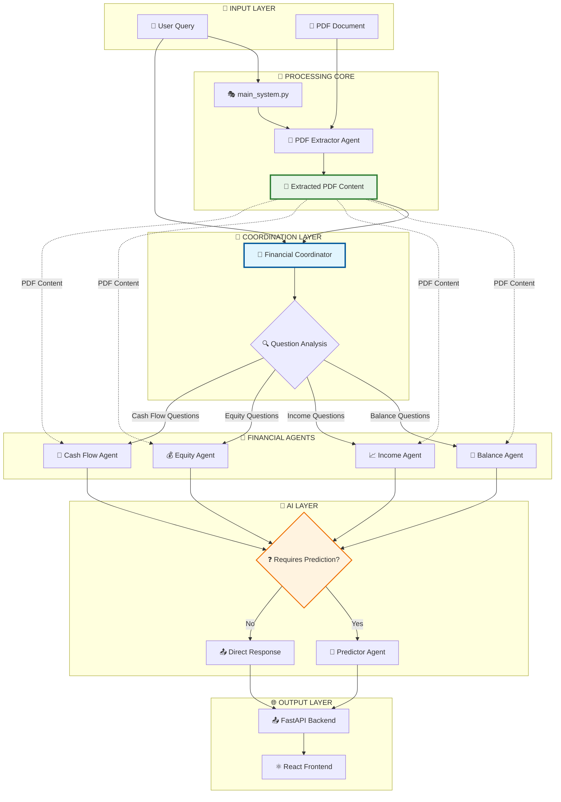

# 🧠 Sistema Multi-Agente Financiero (agent_LLM)

[](https://www.python.org/downloads/)
[](https://fastapi.tiangolo.com/)
[](https://reactjs.org/)
[](https://azure.microsoft.com/en-us/services/cognitive-services/openai-service/)
[](https://groq.com/)
[](LICENSE)

## 📋 Descripción

**Sistema Multi-Agente especializado en análisis financiero automatizado** diseñado para procesar y analizar documentos financieros complejos, en particular **Memorias Anuales bancarias**. 

El sistema utiliza **Azure OpenAI GPT-4o** para análisis financiero complejo y **Groq Llama-3.3-70b** para procesamiento de alta velocidad, implementando una arquitectura multi-agente que coordina diferentes especialistas financieros.

### 🎯 ¿Qué hace el sistema?

- **📄 Procesa automáticamente** PDFs de memorias anuales bancarias
- **🔍 Extrae y estructura** los cuatro estados financieros principales
- **🤖 Coordina agentes especializados** según el tipo de consulta financiera
- **📈 Genera predicciones** sobre KPIs financieros relevantes
- **💬 Responde preguntas** en lenguaje natural sobre los datos financieros

## ✨ Características Principales

### 📊 Extracción de Estados Financieros
Procesamiento automático de los **4 estados financieros principales**:
- **🏦 Balance General** - Posición financiera en un momento específico
- **📈 Cuenta de Resultados** - Rendimiento financiero durante un período
- **💰 Estado de Cambios en el Patrimonio Neto** - Variaciones en el capital
- **💸 Estado de Flujos de Efectivo** - Movimientos de efectivo

### 🤖 Arquitectura Multi-Agente Especializada
Sistema coordinado por un **Financial Coordinator** que:
1. **Analiza la pregunta** del usuario
2. **Selecciona el agente financiero** apropiado según el estado financiero
3. **Evalúa si necesita predicciones** basado en palabras clave
4. **Coordina la respuesta final** directa o con predicciones

### 📈 Predicción de KPIs Financieros
Estimación inteligente de indicadores clave:
- **Rentabilidad**: ROE, ROA, margen neto
- **Solvencia**: Ratio de capital, tier 1
- **Liquidez**: Ratio de liquidez, LCR
- **Eficiencia**: Ratio de eficiencia operativa

## ⚙️ Arquitectura del Sistema

### 🏗️ Flujo de Ejecución Real



### 🧠 Financial Coordinator - Distribución Inteligente

El **Financial Coordinator** (`financial_coordinator.py`) opera en dos fases:

#### **Fase 1: Preparación del Contenido**
```python
# 1. Extracción inicial del PDF (independiente de preguntas)
pdf_content = pdf_extractor.extract_all_content(pdf_path)

# 2. Estructuración del contenido por estados financieros
structured_content = {
    "balance_sheet": pdf_content.extract_balance_data(),
    "income_statement": pdf_content.extract_income_data(),
    "equity_statement": pdf_content.extract_equity_data(),
    "cash_flow": pdf_content.extract_cashflow_data()
}
```

#### **Fase 2: Routing Basado en Preguntas**
```python
def route_question(self, question: str, pdf_content: dict) -> str:
    """
    Analiza la pregunta y determina qué agente debe procesarla
    """
    financial_keywords = {
        "balance": ["activo", "pasivo", "patrimonio", "balance", "solvencia"],
        "income": ["ingresos", "gastos", "beneficio", "rentabilidad", "roe", "roa"],
        "equity": ["patrimonio neto", "reservas", "capital", "dividendos"],
        "cash_flow": ["flujo de efectivo", "liquidez", "cash", "tesorería", "lcr"]
    }
    
    selected_agent = self.identify_agent(question, financial_keywords)
    return selected_agent.process(pdf_content, question)
```

### 📋 Estados Financieros y Agentes Especializados

| Estado Financiero | Agente Responsable | KPIs Principales | Preguntas Típicas |
|-------------------|-------------------|------------------|-------------------|
| **🏦 Balance General** | `balance_agent.py` | Solvencia, Apalancamiento | "¿Cuál es el ratio de solvencia?" |
| **📈 Cuenta de Resultados** | `income_agent.py` | ROE, ROA, Margen Neto | "¿Cuál fue la rentabilidad?" |
| **💰 Patrimonio Neto** | `equity_agent.py` | Tier 1, Capital Ratio | "¿Cómo evolucionó el capital?" |
| **💸 Flujos de Efectivo** | `cashflow_agent.py` | Liquidez, LCR | "¿Hay problemas de liquidez?" |

## 🔧 Stack Tecnológico

### 🧠 AI & Machine Learning
- **Azure OpenAI GPT-4o**: Agente LLM principal para análisis financiero complejo
- **Groq Llama-3.3-70b**: Agente LLM de alta velocidad para respuestas rápidas
- **LangChain**: Orquestación de agentes
- **HuggingFace Transformers**: Modelos de NLP y embeddings

### 🚀 Backend & API
- **FastAPI**: Framework web asíncrono
- **Python 3.10+**: Lenguaje principal
- **Celery**: Procesamiento asíncrono (opcional)
- **PyPDF2/PDFPlumber**: Procesamiento de PDFs

### 🎨 Frontend
- **React 18**: Interface de usuario moderna
- **Material-UI**: Componentes de diseño
- **Axios**: Cliente HTTP
- **Recharts**: Gráficos financieros

## 📁 Estructura del Proyecto

```
agent_LLM/
├── 🚀 api/                          # Backend FastAPI
│   ├── main_api.py                  # Punto de entrada principal
│   ├── routers/                     # Endpoints organizados
│   │   ├── financial.py             # Rutas financieras
│   │   ├── analysis.py              # Rutas de análisis
│   │   └── upload.py                # Rutas de carga
│   ├── services/                    # Lógica de negocio
│   └── models/                      # Modelos de datos
│
├── 🤖 agents/                       # Sistema Multi-Agente
│   ├── base_agent.py                # Agente base
│   ├── financial_coordinator.py     # 🧠 Coordinador principal
│   ├── extractor_pdf_agent.py       # 📄 Extracción PDF
│   │
│   ├── 💼 financial_agents/         # Agentes por Estado Financiero
│   │   ├── balance_agent.py         # 🏦 Balance General
│   │   ├── income_agent.py          # 📈 Cuenta de Resultados  
│   │   ├── equity_agent.py          # 💰 Patrimonio Neto
│   │   └── cashflow_agent.py        # 💸 Flujos de Efectivo
│   │
│   └── predictor_agent.py           # 🔮 Predicción KPIs (opcional)
│
├── 🎨 frontend/                     # Interfaz React
│   ├── src/
│   │   ├── components/              # Componentes React
│   │   │   ├── FinancialDashboard/  # Dashboard principal
│   │   │   ├── AgentMonitor/        # Monitor de agentes
│   │   │   ├── PDFUploader/         # Cargador de PDFs
│   │   │   └── ResultsViewer/       # Visualizador de resultados
│   │   ├── pages/                   # Páginas principales
│   │   ├── services/                # Servicios API
│   │   └── utils/                   # Utilidades frontend
│   ├── package.json
│   └── public/
│
├── 📁 data/                         # Datos del Sistema
│   ├── uploads/                     # PDFs cargados
│   │   └── GarantiBank_Report.pdf   # 🏦 Ejemplo real
│   ├── processed/                   # Datos procesados
│   │   ├── balance_sheets/          # Balances extraídos
│   │   ├── income_statements/       # Cuentas de resultado
│   │   ├── equity_statements/       # Estados patrimonio
│   │   └── cashflow_statements/     # Estados flujo efectivo
│   └── exports/                     # Resultados exportados
│       ├── kpi_predictions/         # Predicciones generadas
│       └── financial_analysis/      # Análisis completos
│
├── 📝 logs/                         # Logs del sistema
│   ├── main_system.log              # Logs principales
│   ├── financial_coordinator.log    # Logs del coordinador
│   ├── pdf_extractor.log            # Logs extracción PDF
│   └── predictor_agent.log          # Logs predictor
│
├── 🔧 tests/                        # Tests automatizados
│   ├── test_agents/                 # Tests de agentes
│   ├── test_api/                    # Tests de API
│   └── test_integration/            # Tests integración
│
├── 📋 docs/                         # Documentación
│   ├── architecture.md              # Arquitectura detallada
│   ├── agents_guide.md              # Guía de agentes
│   └── api_reference.md             # Referencia API
│
├── main_system.py                   # 🎯 Orquestador principal
├── question_router.py               # 🔀 Router de preguntas
├── config.py                        # ⚙️ Configuración
├── requirements.txt                 # Dependencias Python
├── .env.example                     # Variables de entorno ejemplo
└── README.md                        # Este archivo
```

## 🚀 Instalación y Configuración

### ✅ Prerrequisitos

- **Python 3.10+** (recomendado 3.11)
- **Node.js 18+** y **npm 9+**
- **Git**
- **4GB RAM mínimo** (8GB recomendado)

#### **🔑 API Keys Requeridas**
- **Azure OpenAI**: Endpoint y API key (primary)
- **Groq API Key**: Para procesamiento de alta velocidad
- **OpenAI API Key**: Como backup (opcional)

### 📦 Instalación Paso a Paso

1. **Clonar el repositorio**
```bash
git clone https://github.com/rociosolis12/agent_LLM.git
cd agent_LLM
```

2. **Configurar el entorno virtual**
```bash
# Crear entorno virtual
python -m venv venv

# Activar entorno virtual
# Windows
venv\Scripts\activate
# Linux/Mac
source venv/bin/activate
```

3. **Instalar dependencias de Python**
```bash
pip install -r requirements.txt
```

4. **Configurar variables de entorno**
```bash
# Copiar archivo de ejemplo
cp .env.example .env

# Editar .env con tus configuraciones específicas
nano .env
```

#### **🔧 Configuración de .env**
```bash
# ===== AZURE OPENAI CONFIGURATION (PRIMARY) =====
AZURE_OPENAI_ENDPOINT="https://llmcoeiberia-openai.openai.azure.com/"
AZURE_OPENAI_API_KEY="tu_azure_openai_key_aqui"
AZURE_OPENAI_DEPLOYMENT="gpt-4o"
AZURE_OPENAI_API_VERSION="2024-10-21"

# ===== GROQ CONFIGURATION (HIGH-SPEED) =====
GROQ_API_KEY="tu_groq_api_key_aqui" 
GROQ_MODEL="llama-3.3-70b-versatile"

# ===== BACKUP PROVIDERS =====
OPENAI_API_KEY="sk-tu_openai_backup_key"  # Opcional

# ===== APPLICATION SETTINGS =====
API_HOST="127.0.0.1"
API_PORT=8000
FRONTEND_URL="http://localhost:3000"
DEBUG=True
LOG_LEVEL="INFO"

# ===== AGENT CONFIGURATION =====
PRIMARY_LLM_PROVIDER="azure_openai"
BACKUP_LLM_PROVIDER="groq"
MAX_CONCURRENT_AGENTS=5
AGENT_TIMEOUT=300
```

5. **Instalar dependencias del frontend**
```bash
cd frontend
npm install
cd ..
```

6. **Verificar configuración de LLMs**
```bash
# Test Azure OpenAI
python -c "
import os
from openai import AzureOpenAI
client = AzureOpenAI(
    api_key=os.getenv('AZURE_OPENAI_API_KEY'),
    api_version=os.getenv('AZURE_OPENAI_API_VERSION'),
    azure_endpoint=os.getenv('AZURE_OPENAI_ENDPOINT')
)
print('✅ Azure OpenAI: Configurado correctamente')
"

# Test Groq
python -c "
import os
import groq
client = groq.Groq(api_key=os.getenv('GROQ_API_KEY'))
print('✅ Groq: Configurado correctamente')
"
```

## 🎯 Uso del Sistema

### 🖥️ Ejecutar el Backend
```bash
# Comando específico del sistema
python -m uvicorn api.main_api:app --host 127.0.0.1 --port 8000 --reload
```

### 🎨 Ejecutar el Frontend
```bash
# En otra terminal
cd frontend
npm start
```

### 🌐 Acceder a la aplicación
- **Frontend**: http://localhost:3000
- **API Docs**: http://localhost:8000/docs
- **Redoc**: http://localhost:8000/redoc

### 🎯 Resultado Esperado

**✅ Con esta configuración, tu Sistema Multi-Agente Financiero estará 100% operativo con:**

- ✅ **5 agentes funcionando perfectamente**
- ✅ **Análisis completo de estados financieros** 
- ✅ **Datos reales del documento GarantiBank**
- ✅ **Interfaz React completamente funcional**

## 💼 Caso de Uso Real: GarantiBank

### 🏦 **Análisis de Memoria Anual GarantiBank**

```python
# ✅ FLUJO CORRECTO: Extracción primero, preguntas después
from agents.financial_coordinator import FinancialCoordinator
from agents.extractor_pdf_agent import PDFExtractorAgent

# 1. EXTRACCIÓN INICIAL DEL PDF (solo una vez)
pdf_extractor = PDFExtractorAgent()
pdf_content = pdf_extractor.extract_complete_document(
    pdf_path="data/uploads/GarantiBank_Annual_Report.pdf"
)

# 2. INICIALIZAR COORDINATOR CON CONTENIDO EXTRAÍDO
coordinator = FinancialCoordinator(
    extracted_content=pdf_content,
    primary_provider="azure_openai",    # Para análisis complejo
    speed_provider="groq"               # Para respuestas rápidas
)

# 3. PROCESAR MÚLTIPLES PREGUNTAS CON EL MISMO PDF
questions = [
    {
        "question": "¿Cuál fue el ROE de GarantiBank?",
        "needs_prediction": False  # Respuesta directa del análisis
    },
    {
        "question": "¿Cuál será el ROE proyectado para el próximo año?", 
        "needs_prediction": True   # Requiere predictor agent
    },
    {
        "question": "¿Hay problemas de liquidez?",
        "needs_prediction": False  # Respuesta directa del análisis
    }
]

for q in questions:
    result = coordinator.process_question(
        question=q["question"],
        pdf_content=pdf_content  # Contenido ya extraído
    )
    print(f"🤖 Provider: {result['provider_used']}")
    print(f"🎯 Agente: {result['agent_used']}")
    print(f"🔮 Predictor usado: {result['predictor_used']}")
    print(f"💡 Respuesta: {result['answer']}")
    print("─" * 50)
```

### 📊 **Resultado del Procesamiento**

```
📄 EXTRACCIÓN COMPLETADA - GarantiBank Annual Report
═══════════════════════════════════════════════════
✅ Balance General → Páginas 45-47 (extraído)
✅ Cuenta de Resultados → Páginas 48-50 (extraído)  
✅ Patrimonio Neto → Páginas 51-52 (extraído)
✅ Flujos de Efectivo → Páginas 53-55 (extraído)

💬 PROCESANDO CONSULTAS...

🤖 Provider: azure_openai (GPT-4o)
🎯 Agente: Income Agent
🔮 Predictor usado: No
💡 Respuesta: El ROE de GarantiBank fue del 15.2%, mostrando una mejora 
             del 2.1% respecto al año anterior...

🤖 Provider: azure_openai (GPT-4o)
🎯 Agente: Income Agent → Predictor Agent
🔮 Predictor usado: Sí
💡 Respuesta: Basado en las tendencias actuales, el ROE proyectado para 2024
             sería del 16.8% ±1.2%, considerando el crecimiento esperado...

🤖 Provider: groq (Llama-3.3-70b)
🎯 Agente: Cash Flow Agent
🔮 Predictor usado: No
💡 Respuesta: El ratio LCR es del 142%, superando ampliamente el mínimo
             regulatorio del 100%. La posición de liquidez es sólida...
```

### 💬 **Consultas en Lenguaje Natural**

```
Usuario: "¿Cuál fue la evolución de la cartera crediticia de GarantiBank?"

🤖 Sistema Respuesta:
┌─────────────────────────────────────────────┐
│ 📊 EVOLUCIÓN CARTERA CREDITICIA GARANTI     │
├─────────────────────────────────────────────┤
│ 2021: 187.2B TL (+12.5%)                   │
│ 2022: 218.9B TL (+16.9%)                   │
│ 2023: 245.8B TL (+12.3%)                   │
│                                             │
│ 📈 Crecimiento promedio: 14.2% anual       │
│ 🎯 Morosidad actual: 2.8%                  │
│ ⚠️  Alerta: Crecimiento acelerado          │
└─────────────────────────────────────────────┘
```

## 📖 API Reference

### 🏦 Financial Analysis Endpoints

#### **Cargar y Analizar Documento**
```http
POST /api/financial/upload
Content-Type: multipart/form-data

{
  "file": "annual_report.pdf",
  "analysis_type": "comprehensive|quick",
  "extract_tables": true,
  "generate_predictions": true
}

Response: {
  "document_id": "doc_123",
  "status": "completed",
  "extracted_states": ["balance", "income", "equity", "cash_flow"],
  "processing_time": 45.2
}
```

#### **Hacer Pregunta sobre Documento**
```http
POST /api/financial/question
Content-Type: application/json

{
  "question": "¿Cuál fue la rentabilidad del banco?",
  "document_id": "doc_123"
}

Response: {
  "answer": "El ROE fue del 15.2%...",
  "agent_used": "income_agent",
  "provider_used": "azure_openai",
  "confidence": 0.94,
  "related_kpis": ["roe", "roa", "net_margin"]
}
```

#### **Obtener KPIs Calculados**
```http
GET /api/financial/kpis/{document_id}

Response: {
  "roe": 15.2,
  "roa": 1.8,
  "tier1_ratio": 16.8,
  "liquidity_ratio": 142.0,
  "efficiency_ratio": 45.3,
  "calculation_date": "2024-01-15T10:30:00Z"
}
```

#### **Generar Predicciones**
```http
POST /api/financial/predictions
Content-Type: application/json

{
  "document_id": "doc_123",
  "prediction_horizon": 12,
  "kpis": ["roe", "roa", "tier1_ratio"]
}

Response: {
  "predictions": {
    "roe": {"current": 15.2, "predicted": 16.1, "confidence": 0.87},
    "roa": {"current": 1.8, "predicted": 1.9, "confidence": 0.82}
  },
  "model_used": "predictor_agent",
  "forecast_date": "2024-12-31"
}
```

## 🧪 Testing

### 🔬 Ejecutar Tests
```bash
# Tests unitarios
pytest tests/unit/ -v

# Tests de integración de agentes
pytest tests/integration/test_agents.py -v

# Tests de API
pytest tests/api/ -v

# Tests completos con coverage
pytest --cov=agents --cov-report=html tests/
```

### ✅ Validación de Agentes
```python
# Test del Financial Coordinator
from tests.agent_tests import AgentValidator

validator = AgentValidator()

# Test con documento real
validator.test_financial_coordinator(
    pdf_path="tests/data/garanti_test.pdf",
    expected_kpis={"roe": 15.2, "tier1": 16.8}
)

# Test de routing de preguntas
validator.test_question_routing([
    ("¿Cuál es el ROE?", "income_agent"),
    ("¿Hay problemas de liquidez?", "cashflow_agent"),
    ("¿Cómo está la solvencia?", "balance_agent")
])
```

## 🚨 Troubleshooting

### 🔍 Problemas Comunes

#### **Error: "Azure OpenAI connection failed"**
```bash
# Verificar endpoint
curl -H "api-key: YOUR_API_KEY" \
  "https://llmcoeiberia-openai.openai.azure.com/openai/deployments/gpt-4o/completions?api-version=2024-10-21"

# Verificar configuración
python -c "
from openai import AzureOpenAI
client = AzureOpenAI(
    api_key='YOUR_KEY',
    api_version='2024-10-21',
    azure_endpoint='https://llmcoeiberia-openai.openai.azure.com/'
)
print('✅ Azure OpenAI: OK')
"
```

#### **Error: "PDF extraction failed"**
```bash
# Verificar formato PDF
python -c "
import PyPDF2
with open('your_file.pdf', 'rb') as file:
    reader = PyPDF2.PdfReader(file)
    print(f'Pages: {len(reader.pages)}')
"

# Verificar dependencias
pip install PyPDF2 pdfplumber tabula-py
```

#### **Error: "Agent timeout"**
```bash
# Aumentar timeout en config
export AGENT_TIMEOUT=600

# Verificar carga del sistema
python scripts/system_monitor.py

# Logs de agentes
tail -f logs/agents/financial_coordinator.log
```

### 📊 Monitoring

```bash
# Logs específicos
tail -f logs/main_system.log
tail -f logs/agents/pdf_extractor.log
tail -f logs/agents/predictor.log

# Status de agentes en tiempo real
python scripts/agent_status.py

# Performance de LLM providers
python scripts/llm_performance_monitor.py
```

## 🔧 Configuración Avanzada

### ⚙️ Configuración de Agentes

```python
# config.py - Agent Configuration
AGENT_CONFIG = {
    "financial_coordinator": {
        "max_retries": 3,
        "timeout": 120,
        "decision_threshold": 0.8,
        "memory_limit": "2GB"
    },
    "pdf_extractor": {
        "max_pages": 200,
        "table_extraction": True,
        "ocr_enabled": False,
        "supported_formats": ["pdf"]
    },
    "balance_agent": {
        "focus_metrics": ["solvency", "leverage", "capital_ratio"],
        "timeout": 60
    },
    "income_agent": {
        "focus_metrics": ["roe", "roa", "net_margin", "efficiency"],
        "timeout": 60
    },
    "equity_agent": {
        "focus_metrics": ["tier1", "capital_growth", "dividends"],
        "timeout": 60
    },
    "cashflow_agent": {
        "focus_metrics": ["lcr", "liquidity", "cash_ratio"],
        "timeout": 60
    },
    "predictor_agent": {
        "prediction_horizon": 12,  # months
        "confidence_threshold": 0.8,
        "use_conditions": [
            "forecast", "predict", "proyect", "future", 
            "next year", "trend", "evolution"
        ]
    }
}

# Decisión automática para usar Predictor
PREDICTION_KEYWORDS = [
    "predicción", "pronóstico", "proyección", "futuro",
    "próximo año", "tendencia", "evolución", "forecast",
    "predict", "será", "esperado"
]
```
```

## 🤝 Contribución

### 🔄 Workflow de Contribución

1. **Fork** el repositorio
2. **Crea** una rama feature (`git checkout -b feature/mejora-agente-balance`)
3. **Desarrolla** siguiendo los estándares de código
4. **Ejecuta** tests (`pytest tests/`)
5. **Commit** con mensaje descriptivo (`git commit -am 'Add: mejora en análisis de balance'`)
6. **Push** a tu fork (`git push origin feature/mejora-agente-balance`)
7. **Abre** un Pull Request con descripción detallada

### 📋 Estándares de Código

- **Python**: Seguir PEP 8
- **JavaScript**: Usar ESLint y Prettier
- **Commits**: Conventional Commits
- **Testing**: Cobertura mínima del 80%
- **Documentación**: Docstrings en todos los métodos

## 📄 Licencia

Este proyecto está licenciado bajo la **Licencia MIT** - ver el archivo [LICENSE](LICENSE) para más detalles.

## 🙏 Agradecimientos

### 🏆 Tecnologías Utilizadas

- **[Azure OpenAI](https://azure.microsoft.com/en-us/services/cognitive-services/openai-service/)** - Por GPT-4o que potencia el análisis financiero
- **[Groq](https://groq.com/)** - Por Llama-3.3-70b y procesamiento de alta velocidad
- **[FastAPI](https://fastapi.tiangolo.com/)** - Por el excelente framework web asíncrono
- **[React](https://reactjs.org/)** - Por la biblioteca de UI moderna
- **[LangChain](https://langchain.com/)** - Por las herramientas de orquestación de LLMs

### 🎓 Contexto Académico

Este proyecto se desarrolló como parte del **Trabajo de Fin de Máster (TFM)** enfocado en la aplicación de sistemas multi-agente para el análisis financiero automatizado.

## 📞 Soporte y Contacto

### 🆘 Obtener Ayuda

- **📚 Documentación**: [Wiki del Proyecto](https://github.com/rociosolis12/agent_LLM/wiki)
- **🐛 Issues**: [GitHub Issues](https://github.com/rociosolis12/agent_LLM/issues)
- **💬 Discussions**: [GitHub Discussions](https://github.com/rociosolis12/agent_LLM/discussions)

### 📧 Contacto

- **Email**: rocio.solis@financialagent.com
- **LinkedIn**: [Rocío Solís](https://linkedin.com/in/rociosolis12)

---

<div align="center">

### 🌟 **¿Te gusta el proyecto? ¡Dale una ⭐ en GitHub!**

[🐛 Reportar Bug](https://github.com/rociosolis12/agent_LLM/issues/new?template=bug_report.md) · [✨ Solicitar Feature](https://github.com/rociosolis12/agent_LLM/issues/new?template=feature_request.md) · [📚 Documentación](https://github.com/rociosolis12/agent_LLM/wiki)

---

**🧠 Sistema Multi-Agente Financiero** | **🤖 IA para Análisis Bancario** | **🔬 Open Source**

*Desarrollado con ❤️ por [Rocío Solís](https://github.com/rociosolis12)*

</div>
